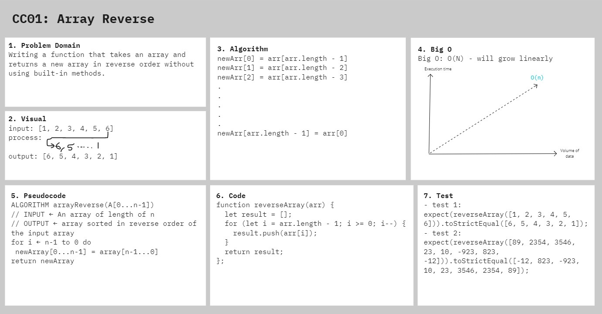

# Array Reverse

Reverse an array without using array methods.

## Challenge

Write a function called reverseArray which takes an array as an argument. Without utilizing any of the built-in methods available to your language, return an array with elements in reversed order.

## Approach & Efficiency

I took the approach of making a for loop that loops through the input array starting at the last value, and pushing that value into the results array. Then, pulling the second to last value and pushing that value into the results array. Doing a for loop was what came to mind first, and it felt like a straight forward way to approach it.

## Solution

