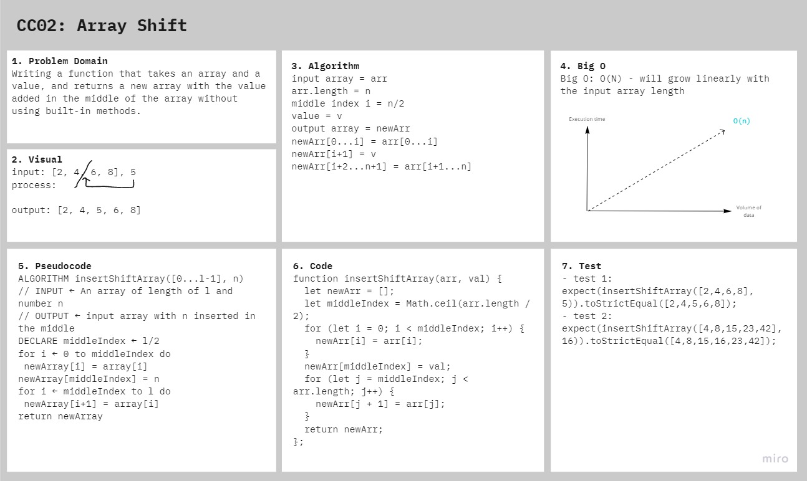

# Array Shift

Insert and shift an array in middle index.

## Challenge

Take in an array and value to be added, return an array with the new value added at the middle index.

### Stretch Goal

Take an array and remove the element from the middle index and shift other elements in the array to fill the new gap.

## Approach & Efficiency

I took the approach of finding the middle index of the input array, the index to add the value in, and split the input array into two divisions, before the middle index and after the middle index, then declared a new array, pushed the first division, then the input value, then the second division 

## Solution

