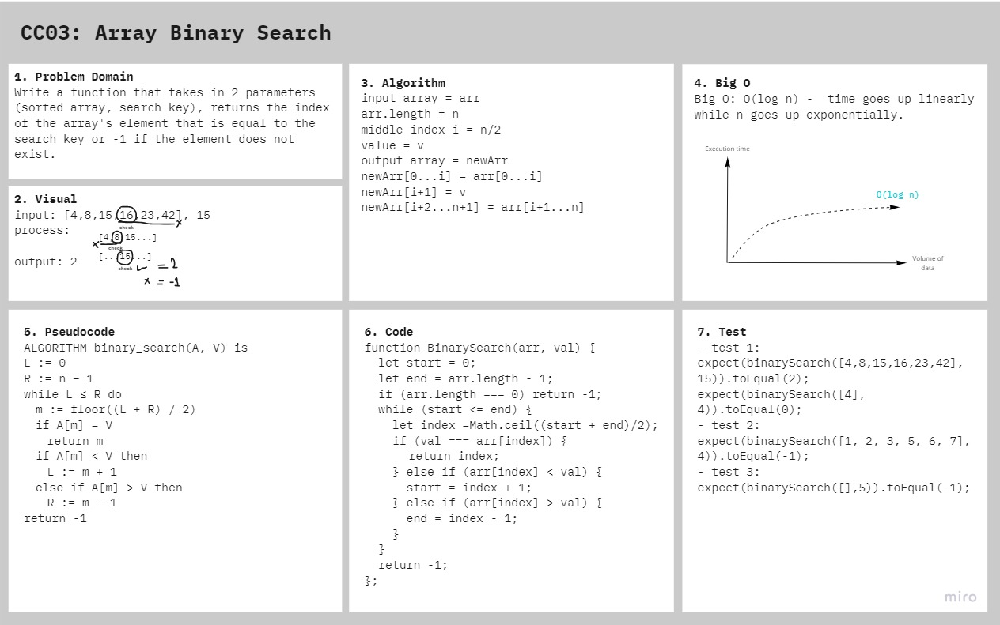

# Array Binary Search

Binary search in a sorted 1D array

## Challenge

Write a function that takes in 2 parameters (sorted array, search key), return the index of the array's element that is equal to the search key or -1 if the element does not exist.

## Approach & Efficiency

First, we talked about what binary search is, then defined the range of the search, what kind of loop we need, and how to change the search range.

## Solution

## Resources and Collaborators

- Worked at lab table with Bahaa Zghayar
- [Medium article](https://medium.com/@jeffrey.allen.lewis/javascript-algorithms-explained-binary-search-25064b896470)
- [Wikipedia](https://en.wikipedia.org/wiki/Binary_search_algorithm)
- [Geeks for Geeks](https://www.geeksforgeeks.org/binary-search-in-javascript/)
