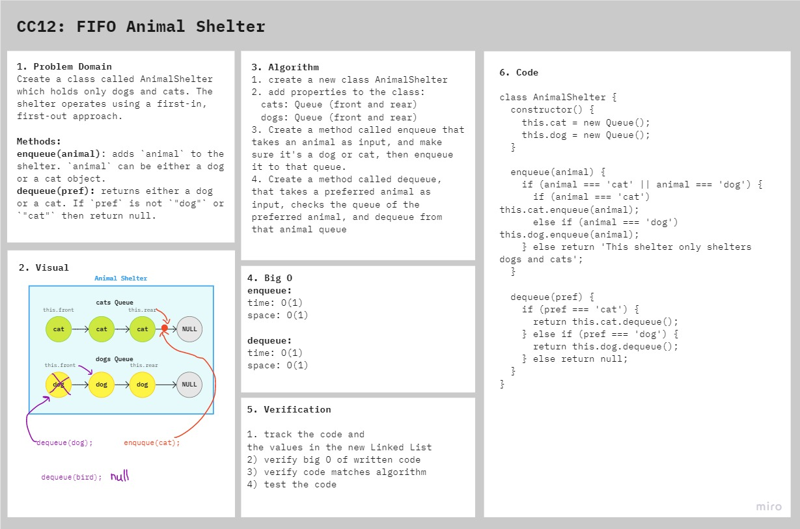

# FIFO Animal Shelter

First-in, First out Animal Shelter.

## Challenge

### Features

- Create a class called AnimalShelter which holds only dogs and cats. The shelter operates using a first-in, first-out approach.
- Implement the following methods:
  - `enqueue(animal)`: adds `animal` to the shelter. `animal` can be either a dog or a cat object.
  - `dequeue(pref)`: returns either a dog or a cat. If `pref` is not `"dog"` or `"cat"` then return null.
- If a cat or dog isn’t preferred, return whichever animal has been waiting in the shelter the longest.

### Structure and Testing

run `npm test fifo-animal-shelter` to check that the functions are working correctly

## Approach & Efficiency

1. Created the AnimalShelter class which will utilize three Queues.
2. Created the `.enqueue(animal)` method for the class utilizing the two queues and their `.enqueue(value)` and `.dequeue()` methods
3. created the `.dequeue(pref)` method for the class using a conditional to verify the AnimalShelter contains the preferred and if it does, uses `.dequeue` method of the queue to remove and return it.
4. Made sure everything was setup properly by consoling logging
5. Created tests to verify functionality

## Solution

<!-- ## Resources and Collaborators -->

