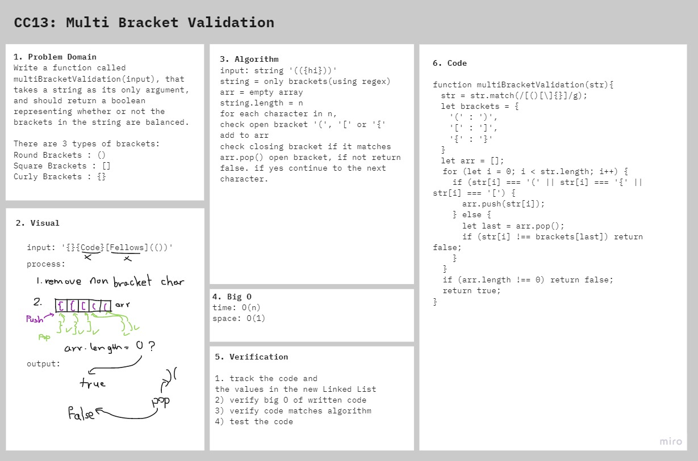

# Multi-bracket Validation

Multi-bracket Validation.

## Challenge

### Features

Write a function called multiBracketValidation(input) that takes a string as its only argument, and should return a boolean representing whether or not the brackets in the string are balanced. There are 3 types of brackets:
- Round Brackets : ()
- Square Brackets : []
- Curly Brackets : {}

### Structure and Testing

run `npm test multi-bracket-validation` to check that the functions are working correctly

## Approach & Efficiency

I took the approach of eliminating non bracket characters first using regex, then match each bracket with its closing bracket. then continued with the function and make sure that **time O(n)** and **space O(1)**

## Solution

## Resources and Collaborators
- Parenthesis Matching Problem in JavaScript on [Medium](https://paulrohan.medium.com/parenthesis-matching-problem-in-javascript-the-hacking-school-hyd-7d7708278911)