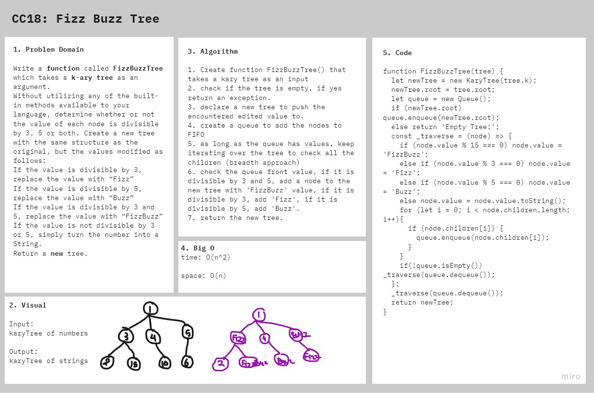

# Fizz Buzz Tree

Conduct “FizzBuzz” on a k-ary tree while traversing through it to create a new tree.

Set the values of each of the new nodes depending on the corresponding node value in the source tree.

## Challenge

### Features

- Write a function called FizzBuzzTree which takes a k-ary tree as an argument.
- Without utilizing any of the built-in methods available to your language, determine whether or not the value of each node is divisible by 3, 5 or both. Create a new tree with the same structure as the original, but the values modified as follows:
    - If the value is divisible by 3, replace the value with “Fizz”
    - If the value is divisible by 5, replace the value with “Buzz”
    - If the value is divisible by 3 and 5, replace the value with “FizzBuzz”
    - If the value is not divisible by 3 or 5, simply turn the number into a String.
- Return a new tree.

### Structure and Testing

run `npm test fizz-buzz-tree` to check that the functions are working correctly

## Approach & Efficiency

I took the approach of iterating over the tree (breadth first approach) to modify the nodes as needed.

 **time O(n^2)** and **space O(n)**

## Solution

## Resources and Collaborators
- Code Fellows docs on [Trees](https://codefellows.github.io/common_curriculum/data_structures_and_algorithms/Code_401/class-15/resources/Trees.html)