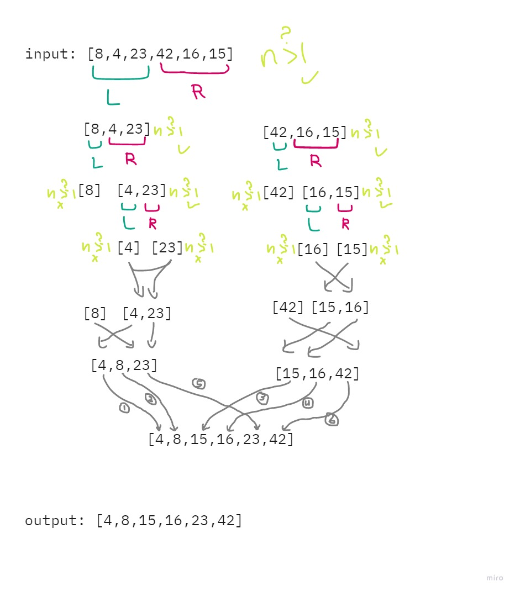

# Merge Sort

Merge Sort is a sorting algorithm that is based off of dividing the array into smaller arrays till the size becomes 1. Once the size becomes 1, the merge processes come into action and start merging arrays back using a helper function till the complete array is merged.

## Pseudocode

```html
ALGORITHM Mergesort(arr) DECLARE n <-- arr.length if n > 1 DECLARE mid <-- n/2
DECLARE left <-- arr[0...mid] DECLARE right <-- arr[mid...n] // sort the left
side Mergesort(left) // sort the right side Mergesort(right) // merge the sorted
left and right sides together Merge(left, right, arr) ALGORITHM Merge(left,
right, arr) DECLARE i <-- 0 DECLARE j <-- 0 DECLARE k <-- 0 while i <
left.length && j < right.length if left[i] <= right[j] arr[k] <-- left[i] i <--
i + 1 else arr[k] <-- right[j] j <-- j + 1 k <-- k + 1 if i = left.length set
remaining entries in arr to remaining values in right else set remaining entries
in arr to remaining values in left
```

## Walkthrough sample input

Sample array: [8,4,23,42,16,15]

- **Step 1:** On the first function call, `arr.length = 6`, so `n = 3`, `left = [8,4,23]` and `right = [42,16,15]`. And the recursive function will run for the left array, which has `arr.length = 3`, so `n = 1`, `left = [8]` and `right = [4,23]`, then the recursive function for the left array will evaluate to false, and it'll run for the right array, which has `arr.length = 2`, so `n = 1`, `left = [4]` and `right = [23]`, and the dividing for the first half is done, it'll run the first merge for `left,right,arr` as `[4],[23],[4,23]`, which will return `[4,23]`, then the second merge for `left,right,arr` as `[8],[4,23],[8,4,23]`, which will add to the array in each iteration, `[4,4,23] => [4,8,23]` and return `[4,8,23]`, and the first left is done.

- **Step 2:** So now, the `mergeSort` function will run for the right array `[42,16,15]`, which has `arr.length = 3`, so `n = 1`, `left = [42]` and `right = [16,15]`, then the recursive function for the left array will evaluate to false, and it'll run for the right array, which has `arr.length = 2`, so `n = 1`, `left = [16]` and `right = [15]`, and the dividing for the second half is done, it'll run the first merge for `left,right,arr` as `[16],[15],[16,15]`, which will which will add to the array in each iteration `[15,15] => [15,16]` and return `[15,16]`, then the second merge for `left,right,arr` as `[42],[15,16],[42,16,15]`, which will add to the array in each iteration, `[15,16,15] => [15,16,42]` and return `[15,16,42]`, and the first right is done.

- **Step 3:** Now for the final merge, which has the values `[4,8,23],[15,16,42],[8,4,23,42,16,15]` for the `left,right,arr` arguments, which will add th the array in `n` steps, which in this case is `6` as the following:
- n = 1: `[4,4,23,42,16,15]`
- n = 2: `[4,8,23,42,16,15]`
- n = 3: `[4,8,15,42,16,15]`
- n = 4: `[4,8,15,16,16,15]`
- n = 5: `[4,8,15,16,23,15]`
- n = 6: `[4,8,15,16,23,42]`




## Efficiency

- Time: O(n log n)

This algorithm works better with larger arrays than smaller ones.

- Space: O(n)

Multiple arrays will be stored in the memory while running the function. 

## More:

- Whiteboard and more information: [README](README.md)
- Link to code: [here](merge-sort.js)
