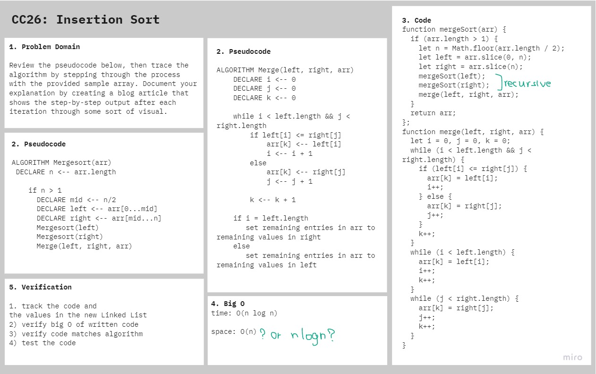

# Merge Sort

Review the pseudocode below, then trace the algorithm by stepping through the process with the provided sample array. Document your explanation by creating a blog article that shows the step-by-step output after each iteration through some sort of visual.

**BLOG link:** [here](BLOG.md)

## Challenge

- Write a blog post stepping through the merge sort algorithm
- Code is working, tested implementation of merge sort based on the provided pseudocode that takes in an array and returns the same array sorted.

## Approach & Efficiency

Stepped through the algorithm step by step visually and then using the provided pseudocode to implement working code
O(n log n) time / O(n) space

## Solution

