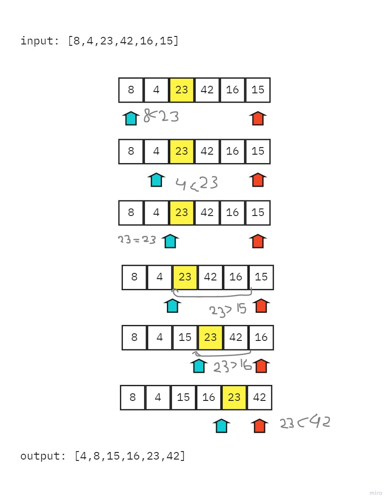

# Merge Sort

Merge Sort is a sorting algorithm that is based off of dividing the array into smaller arrays till the size becomes 1. Once the size becomes 1, the merge processes come into action and start merging arrays back using a helper function till the complete array is merged.

## Pseudocode

```html
ALGORITHM QuickSort(arr, left, right)
    if left < right
        // Partition the array by setting the position of the pivot value 
        DEFINE position <-- Partition(arr, left, right)
        // Sort the left
        QuickSort(arr, left, position - 1)
        // Sort the right
        QuickSort(arr, position + 1, right)

ALGORITHM Partition(arr, left, right)
    // set a pivot value as a point of reference
    DEFINE pivot <-- arr[right]
    // create a variable to track the largest index of numbers lower than the defined pivot
    DEFINE low <-- left - 1
    for i <- left to right do
        if arr[i] <= pivot
            low++
            Swap(arr, i, low)

     // place the value of the pivot location in the middle.
     // all numbers smaller than the pivot are on the left, larger on the right. 
     Swap(arr, right, low + 1)
    // return the pivot index point
     return low + 1

ALGORITHM Swap(arr, i, low)
    DEFINE temp;
    temp <-- arr[i]
    arr[i] <-- arr[low]
    arr[low] <-- temp
```

## Walkthrough sample input

Sample array: [8,4,23,42,16,15]

- **STEP 1:** Determine pivot as middle element. So, 23 is the pivot element.

- **STEP 2:** Start left and right pointers as first and last elements of the array respectively. So, left pointer is pointing to 8 at index 0 and right pointer is pointing to 15 at index 5.

- **STEP 3:** Compare element at the left pointer with the pivot element. Since, 8 < 23 shift left pointer to the right to 4 at index 1.

- **STEP 4:** Now, still 4 < 23 so shift left pointer to one more index to the right. So now 23 = 23 stop incrementing the left pointer and now left pointer is at index 2.

- **STEP 5:** Now, compare value at the right pointer with the pivot element. Since 15 < 23 stop moving the right pointer.

- **STEP 6:** Swap both values present at left and right pointers with each other.

- **STEP 7:** Move both pointers one more step.

- **STEP 8:** Since 16 <23, again, Swap both values present at left and right pointers with each other. move pointers to one more step and stop as left pointer crosses the right pointer and return the index of the left pointer.




## Efficiency

- Time: O(n log n)

This algorithm works better with larger arrays than smaller ones.

- Space: O(n log n)

Multiple arrays will be stored in the memory while running the function. 

## More:

- Whiteboard and more information: [README](README.md)
- Link to code: [here](merge-sort.js)
