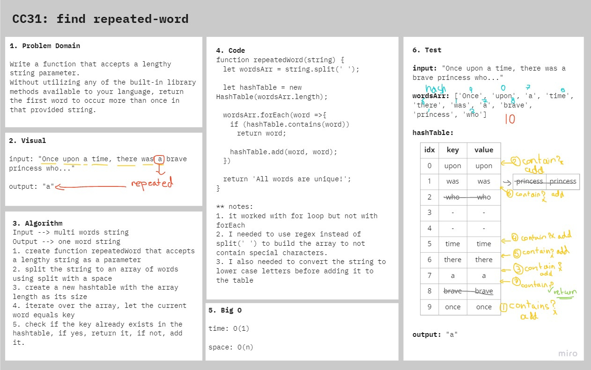

# Repeated Word

Find the first repeated word in a book.

## Challenge

### Features

- Write a function that accepts a lengthy string parameter.
- Without utilizing any of the built-in library methods available to your language, return the first word to occur more than once in that provided string.

### Structure and Testing

run `npm test repeated-word` to check that the function is working correctly

## Approach & Efficiency

1. create function repeatedWord that accepts a lengthy string as a parameter
2. split the string to an array of words using regex
3. create a new hashtable with the array length as its size
4. iterate over the array, let the current word `toLowerCase()` equals key
5. check if the key already exists in the hashtable, if yes, return it, if not, add it.

- **time:** O(1)
- **space:** O(n)

## Solution

## Resources and Collaborators

- [regexr](https://regexr.com/)
