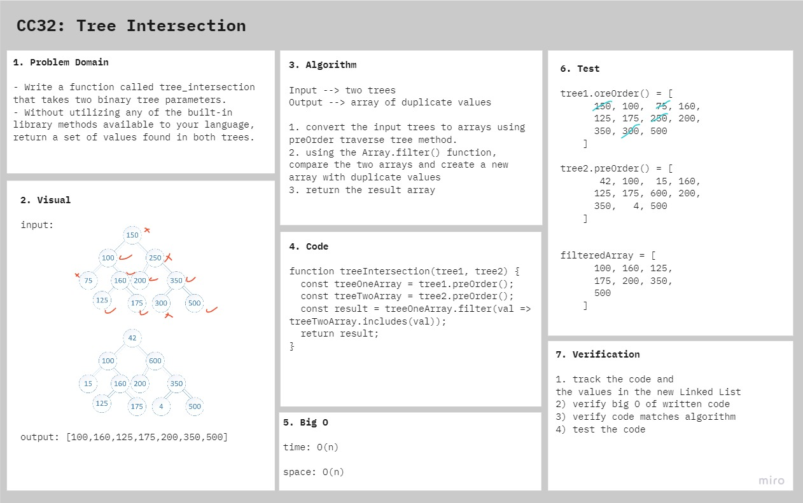

# Tree Intersection

Find common values in 2 binary trees.

## Challenge

### Features

- Write a function called tree_intersection that takes two binary tree parameters.
- Without utilizing any of the built-in library methods available to your language, return a set of values found in both trees.

### Structure and Testing

run `npm test tree-intersection` to check that the function is working correctly

## Approach & Efficiency

1. convert the input trees to arrays using `preOrder()` traverse tree method.
2. using the `Array.filter()` function, compare the two arrays and create a new array with common values
3. return the result array

- **time:** O(n)
- **space:** O(n)

## Solution

<!-- ## Resources and Collaborators -->

