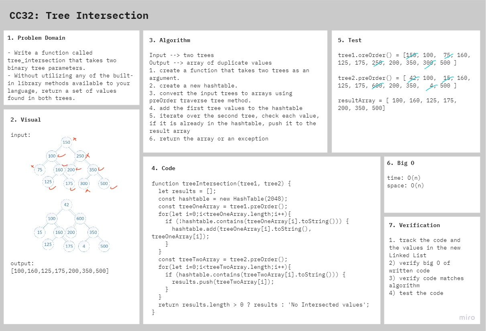

# Tree Intersection

Find common values in 2 binary trees.

## Challenge

### Features

- Write a function called tree_intersection that takes two binary tree parameters.
- Without utilizing any of the built-in library methods available to your language, return a set of values found in both trees.

### Structure and Testing

run `npm test tree-intersection` to check that the function is working correctly

## Approach & Efficiency

1. create a function that takes two trees as an argument.
2. create a new hashtable.
3. convert the input trees to arrays using preOrder traverse tree method.
4. add the first tree values to the hashtable
5. iterate over the second tree, check each value, if it is already in the hashtable, push it to the result array
6. return the array or an exception

- **time:** O(n^2)
- **space:** O(n)

## Solution

<!-- ## Resources and Collaborators -->

