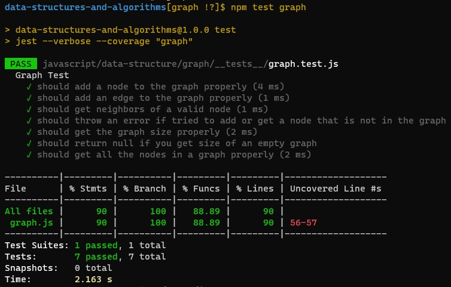

# Graphs

Implementing graphs and its methods.

[PR](https://github.com/afnandamra/data-structures-and-algorithms/pull/39)

## Challenge

### Features

Implement your own Graph. The graph should be represented as an adjacency list, and should include the following methods:

1. `AddNode()`
    - Adds a new node to the graph
    - Takes in the value of that node
    - Returns the added node
2. `AddEdge()`
    - Adds a new edge between two nodes in the graph
    - Include the ability to have a “weight”
    - Takes in the two nodes to be connected by the edge
    - Both nodes should already be in the Graph
3. `GetNodes()`
    - Returns all of the nodes in the graph as a collection (set, list, or similar)
4. `GetNeighbors()`
    - Returns a collection of edges connected to the given node
    - Takes in a given node
    - Include the weight of the connection in the returned collection
5. `Size()`
    - Returns the total number of nodes in the graph

### Structure and Testing

Utilize the Single-responsibility principle: any methods you write should be clean, reusable, abstract component parts to the whole challenge. You will be given feedback and marked down if you attempt to define a large, complex algorithm in one function definition.

Write tests to prove the following functionality:

1. Node can be successfully added to the graph
2. An edge can be successfully added to the graph
3. A collection of all nodes can be properly retrieved from the graph
4. All appropriate neighbors can be retrieved from the graph
5. Neighbors are returned with the weight between nodes included
6. The proper size is returned, representing the number of nodes in the graph
7. A graph with only one node and edge can be properly returned
8. An empty graph properly returns null

## Approach & Efficiency

**Big O:**
- Time **O(1)** for all methods
- Space
   - **O(n)** for addVertex
   - **O(1)** for other methods

## API

<!-- Description of each method publicly available to your Linked List -->

The graph code contains three classes, which are, Graph, Vetex, and Edge. the Graph class depends on on the Vetex and Edge classes, and has these methods:

1. `addNode(vertex)`
    - Adds a new node to the graph
    - Takes in the value of that node
    - Returns the added node
2. `addEdge(startVertex, endVertex, weight)`
    - Adds a new edge between two nodes in the graph
    - Include the ability to have a “weight”
    - Takes in the two nodes to be connected by the edge
    - Both nodes should already be in the Graph
3. `getNodes()`
    - Returns all of the nodes in the graph as a collection (set, list, or similar)
4. `getNeighbors(vertex)`
    - Returns a collection of edges connected to the given node
    - Takes in a given node
    - Include the weight of the connection in the returned collection
5. `getSize()`
    - Returns the total number of nodes in the graph

<!-- ## Solution

 -->

## Resources and Collaborators

- Code Fellows docs on [graphs](https://codefellows.github.io/common_curriculum/data_structures_and_algorithms/Code_401/class-35/resources/graphs.html).
