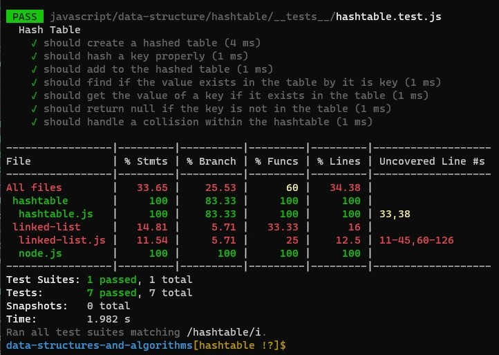

# Hash Tables

Implementing a Hashtable and its methods.

[PR](https://github.com/afnandamra/data-structures-and-algorithms/pull/35)

## Challenge

### Features

Implement a Hashtable with the following methods:

- `add`: takes in both the key and value. This method should hash the key, and add the key and value pair to the table, handling collisions as needed.
- `get`: takes in the key and returns the value from the table.
- `contains`: takes in the key and returns a boolean, indicating if the key exists in the table already.
- `hash`: takes in an arbitrary key and returns an index in the collection.

### Structure and Testing

Utilize the Single-responsibility principle: any methods you write should be clean, reusable, abstract component parts to the whole challenge. You will be given feedback and marked down if you attempt to define a large, complex algorithm in one function definition.

Write tests to prove the following functionality:

1. Adding a key/value to your hashtable results in the value being in the data structure
2. Retrieving based on a key returns the value stored
3. Successfully returns null for a key that does not exist in the hashtable
4. Successfully handle a collision within the hashtable
5. Successfully retrieve a value from a bucket within the hashtable that has a collision
6. Successfully hash a key to an in-range value

## Approach & Efficiency

- **add:** space O(1)/time O(1)
- **hash:** space O(1)/time O(1)
- **contains:** space O(1)/time O(1)
- **get:** space O(1)/time O(1) - time O(n) if there is a collision

## API

<!-- Description of each method publicly available to your Linked List -->

The hashtable code contains a class called HashTable, and it requires the LinkedList class that we've created before, it has these methods:

1. `add(key, value)` method: which takes a key and a value as an argument, hashes the key and adding the pair to the table as {key: value} object.
2. `hash(key)` method: which takes a key as an argument, and returns an index in the array within its range based on this key.
3. `contains(key)` method: which takes a key as an argument, and returns true if the key exists, and returns false otherwise.
4. `get(key)` method: which takes a key as an argument, and returns its value if it exists, and returns null if it does'nt.

<!-- ## Solution

 -->

## Resources and Collaborators

- Code Fellows docs on [hashtables](https://codefellows.github.io/common_curriculum/data_structures_and_algorithms/Code_401/class-30/resources/Hashtables.html).
