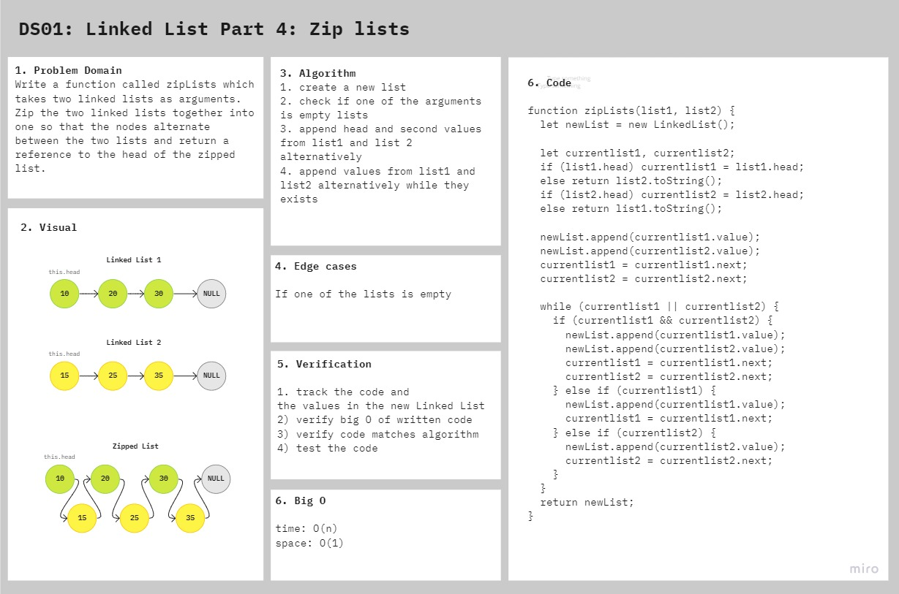

# Singly Linked List Zip

Zip two linked lists.

[ll-zip](https://github.com/afnandamra/data-structures-and-algorithms/pull/22)

## Challenge

### Features

- Write a function called zipLists which takes two linked lists as arguments. Zip the two linked lists together into one so that the nodes alternate between the two lists and return a reference to the head of the zipped list. Try and keep additional space down to O(1). You have access to the Node class and all the properties on the Linked List class as well as the methods created in previous challenges.

### Structure and Testing

run `npm test ll-zip` to check that the function is working correctly

## Approach & Efficiency

- My approach was checking if the lists exists or not first, then append the values one by one, to make sure that **time O(n)** and **space O(1)**

## Solution

