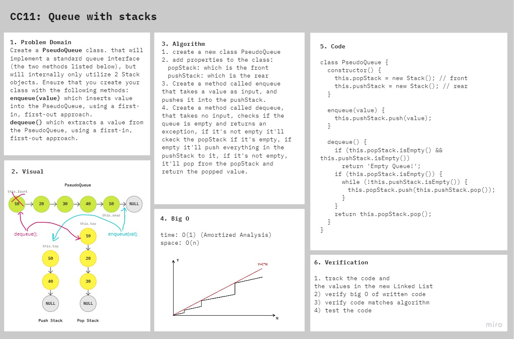

# Queue With Stacks

Implement a Queue using two Stacks.

## Challenge

### Features

- Create a brand new PseudoQueue class. Do not use an existing Queue. Instead, this PseudoQueue class will implement our standard queue interface (the two methods listed below), but will internally only utilize 2 Stack objects. Ensure that you create your class with the following methods:
  - `enqueue(value)` which inserts value into the PseudoQueue, using a first-in, first-out approach.
  - `dequeue()` which extracts a value from the PseudoQueue, using a first-in, first-out approach.
- The Stack instances have only push, pop, and peek methods. You should use your own Stack implementation. Instantiate these Stack objects in your PseudoQueue constructor.

### Structure and Testing

run `npm test queue-with-stacks` to check that the functions are working correctly

## Approach & Efficiency

I took the same approach of enqueue and dequeue without stacks, and then transferred each value to the stack it should be in.

- Time: O(1) - amortized (for enqueue and dequeue operations)
- Space: O(n)

## API

The PseudoQueue class code contains two methods:
1. **`enqueue(value)`** Adds a node to the queue.
2. **`dequeue()`** Removes a node from the queue.

## Solution

## Resources and Collaborators

- Implement Queue Using Stacks on [Youtube](https://www.youtube.com/watch?v=Wg8IiY1LbII&ab_channel=BackToBackSWE).
- Amortized Time Complexity of Algorithms on [medium](https://medium.com/@satorusasozaki/amortized-time-in-the-time-complexity-of-an-algorithm-6dd9a5d38045)
- Code Fellows docs on [Stacks and Queues](https://codefellows.github.io/common_curriculum/data_structures_and_algorithms/Code_401/class-10/resources/stacks_and_queues.html).
