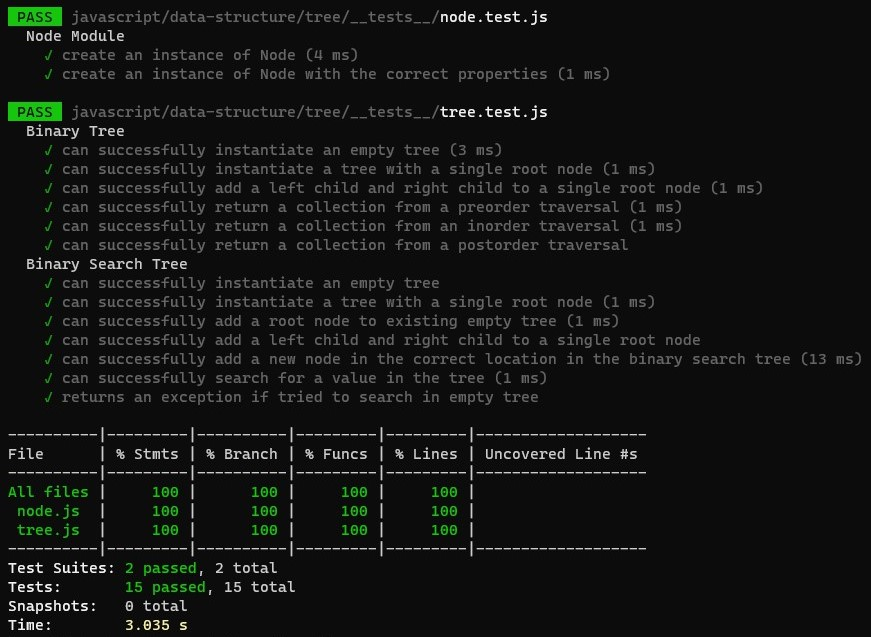
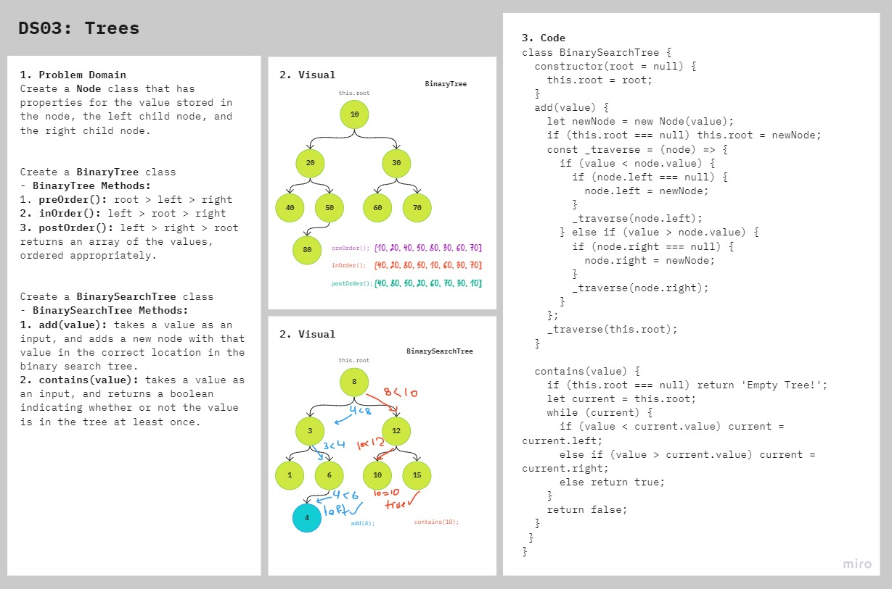
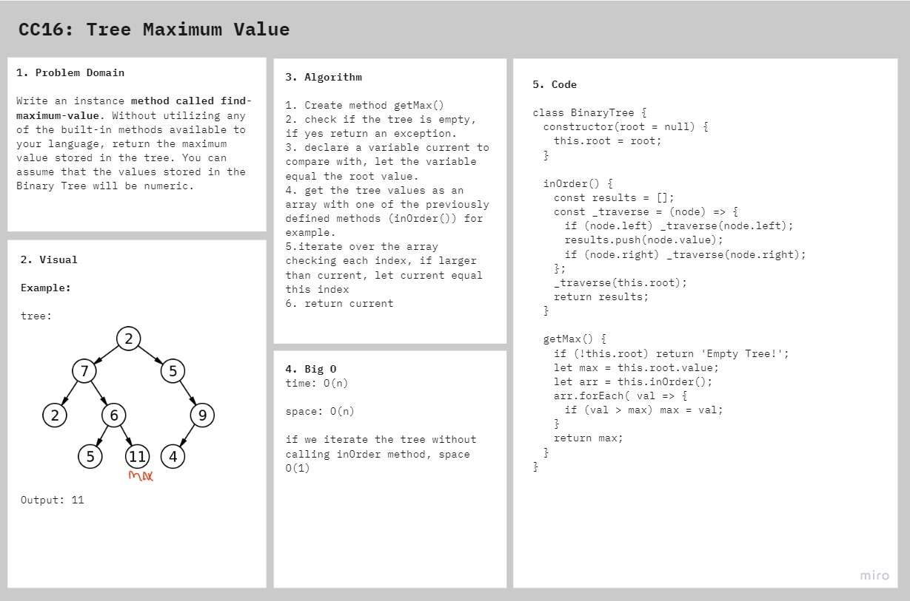
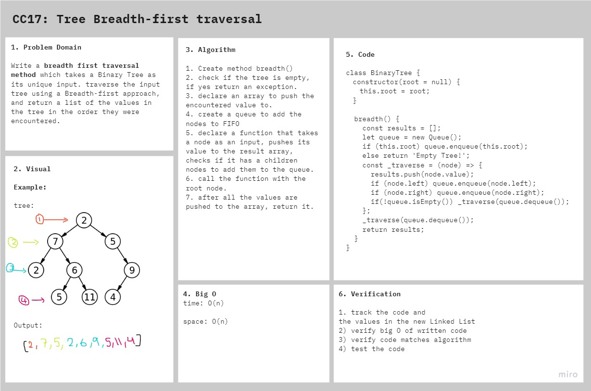

# Trees

1. Binary Tree and Bnary Search Tree Implementation [PR](https://github.com/afnandamra/data-structures-and-algorithms/pull/27)
2. K ary Tree6 [PR](https://github.com/afnandamra/data-structures-and-algorithms/pull/28)
3. Find the Maximum Value in a Binary Tree [PR](https://github.com/afnandamra/data-structures-and-algorithms/pull/29)
4. Breadth-first Traversal [PR](https://github.com/afnandamra/data-structures-and-algorithms/pull/30)

## Challenge

### Features

- Create a Node class that has properties for the value stored in the node, the left child node, and the right child node.
- Create a BinaryTree class
    - Define a method for each of the depth first traversals called preOrder, inOrder, and postOrder which returns an array of the values, ordered appropriately.

- Any exceptions or errors that come from your code should be semantic, capturable errors. For example, rather than a default error thrown by your language, your code should raise/throw a custom, semantic error that describes what went wrong in calling the methods you wrote for this lab.

- Create a BinarySearchTree class
    - Define a method named add that accepts a value, and adds a new node with that value in the correct location in the binary search tree.
    - Define a method named contains that accepts a value, and returns a boolean indicating whether or not the value is in the tree at least once.

### Structure and Testing

Utilize the Single-responsibility principle: any methods you write should be clean, reusable, abstract component parts to the whole challenge. You will be given feedback and marked down if you attempt to define a large, complex algorithm in one function definition.

Write tests to prove the following functionality:

1. Can successfully instantiate an empty tree
2. Can successfully instantiate a tree with a single root node
3. Can successfully add a left child and right child to a single root node
4. Can successfully return a collection from a preorder traversal
5. Can successfully return a collection from an inorder traversal
6. Can successfully return a collection from a postorder traversal

## Approach & Efficiency

### BinaryTree
- preOrder: space O(h)/time O(n)
- inOrder: space O(h)/time O(n)
- postOrder: space O(h)/time O(n)
- getMax: space O(n)/time O(n)
- breadth: space O(n)/time O(n)

### BinarySearchTree
- add(value): space O(1)/time O(n)
- contain(value): space O(1)/time O(n)

## API

<!-- Description of each method publicly available to your Linked List -->

The BinaryTree class contains three methods:

1. **`preOrder()`** Returns an array with the tree values ordered root > left > right.
2. **`inOrder()`** Returns an array with the tree values ordered left > root > right.
3. **`postOrder()`** Returns an array with the tree values ordered root > left > right.
4. **`getMax()`** Returns the maximum value of a numeric tree.
5. **`breadth()`** Returns an array with the tree values ordered by level.

The BinarySearchTree contains two methods:
1. **`add(value)`** Adds the input value in its place in the sorted tree.
2. **`contains(value)`** Search the tree and checks if the input value exists.

## Solution

getMax() method: 

breadth() method: 

## Resources and Collaborators

- Code Fellows docs on [Trees](https://codefellows.github.io/common_curriculum/data_structures_and_algorithms/Code_401/class-15/resources/Trees.html).
- [Binary Search Tree(BST)](https://www.programiz.com/dsa/binary-search-tree).
- Breaking Down Breadth-First Search on [medium](https://medium.com/basecs/breaking-down-breadth-first-search-cebe696709d9#:~:text=Breadth%2Dfirst%20search%20involves%20search,traverse%20through%20the%20grandchildren%20nodes.).